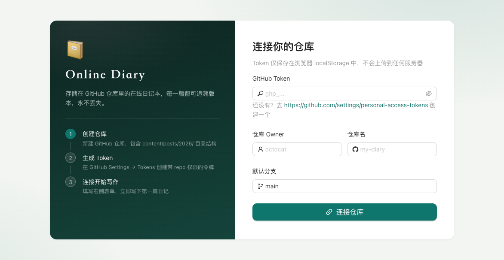
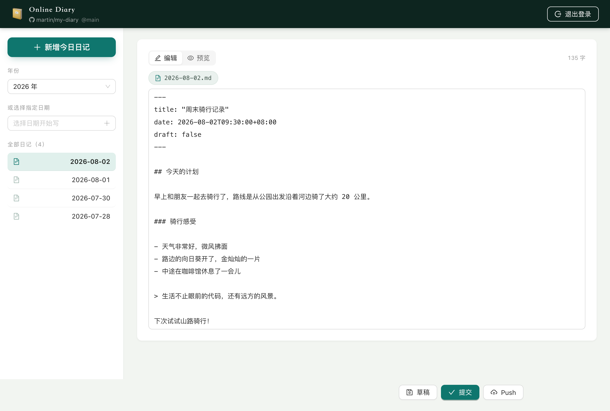
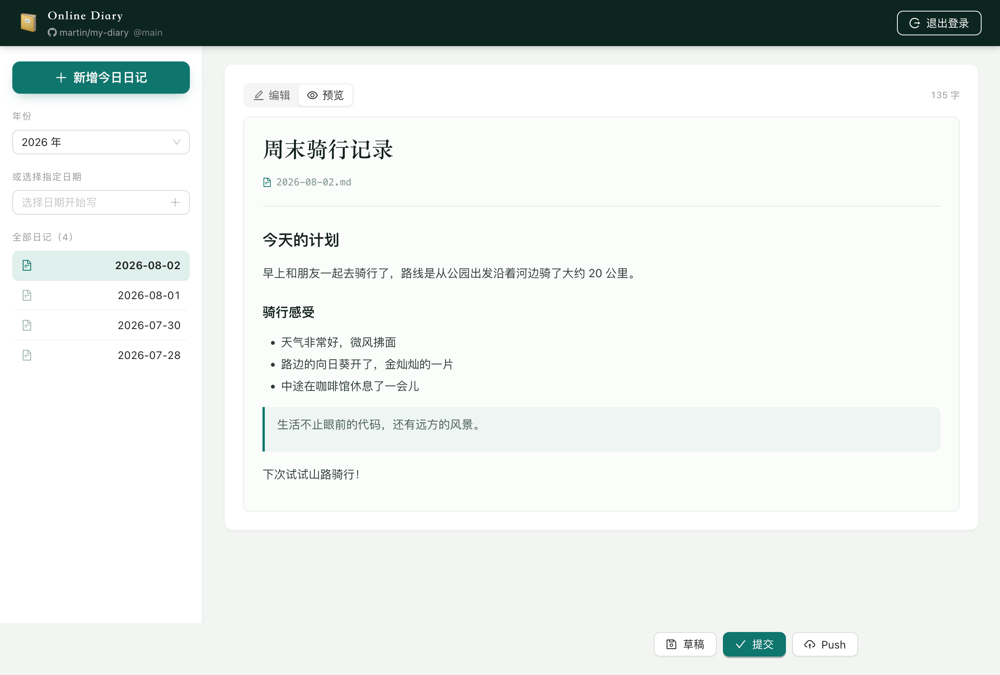
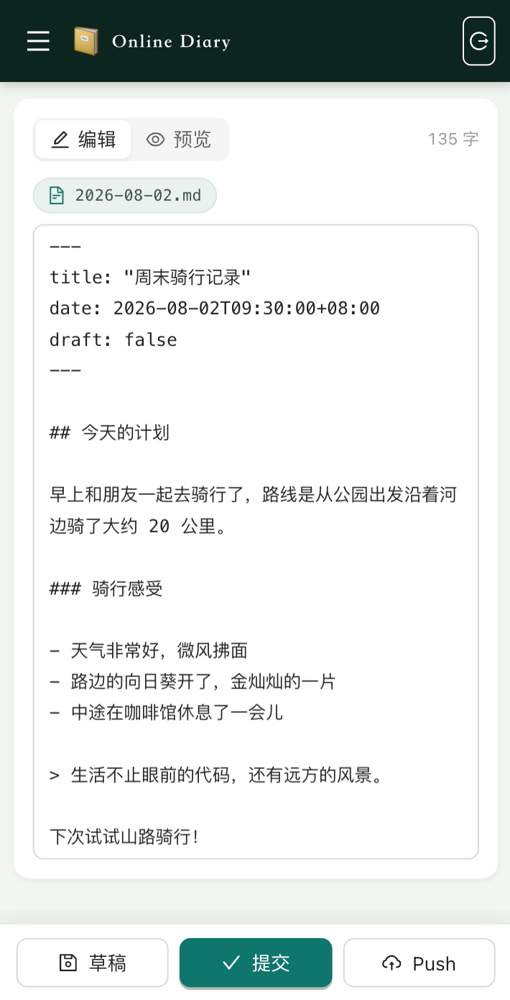

# 📔 Online Diary · 在线日记

一个**纯浏览器端**的 Git 日记应用，无需后端服务器，直接在浏览器中完成 Git 克隆、提交、推送等操作，将 Markdown 日记存储在你的 GitHub 仓库中。

[English](./README.en.md) | 中文

## ✨ 功能特性

- 🌐 **纯前端架构** — 无需后端，所有 Git 操作通过 [isomorphic-git](https://isomorphic-git.org/) 在浏览器中完成
- 📝 **Markdown 编辑器** — 支持实时预览、GFM 语法、YAML Front Matter
- 🔀 **完整 Git 工作流** — 克隆 / 提交 / 推送，日记版本可追溯，永不丢失
- 💾 **离线支持** — 基于 IndexedDB (LightningFS) 的本地文件系统，支持草稿保存
- 📅 **按日期组织** — 文件按 `content/posts/{年}/{日期}.md` 结构存放
- 📱 **移动端适配** — 响应式布局，手机/平板/桌面全兼容
- 🔒 **隐私安全** — Token 仅存储在浏览器 localStorage，不上传任何服务器

## 🖼️ 效果截图

| 仓库连接 | 日记编辑 |
|:---:|:---:|
|  |  |

| Markdown 预览 | 移动端适配 |
|:---:|:---:|
|  |  |

## 🚀 快速开始

### 环境要求

- Node.js >= 18
- npm >= 9

### 安装与运行

```bash
# 克隆项目
git clone https://github.com/<your-username>/web-diary.git
cd web-diary

# 安装依赖
npm install

# 启动开发服务器
npm run dev
```

访问 http://localhost:5173 即可使用。

### 构建生产版本

```bash
npm run build
npm run preview
```

## 🔧 使用指南

### 1. 创建 GitHub 仓库

新建一个 GitHub 仓库，并创建如下目录结构：

```
content/
└── posts/
    └── 2026/
```

### 2. 生成 Personal Access Token

前往 [GitHub Settings → Tokens](https://github.com/settings/personal-access-tokens) 创建一个 Fine-grained PAT，授予以下权限：

- **Contents**: Read and write

### 3. 连接并开始写作

打开应用，填写 Token、仓库 Owner、仓库名和分支，点击「连接仓库」即可开始写日记。

## 🏗️ 技术栈

| 类别 | 技术 |
|------|------|
| 框架 | React 19 |
| 语言 | TypeScript 6 |
| 构建工具 | Vite 8 |
| UI 组件库 | Ant Design 5 |
| Git 引擎 | isomorphic-git + LightningFS |
| Markdown 渲染 | react-markdown + remark-gfm |
| 路由 | React Router 7 |
| 代码检查 | oxlint |

## 📁 项目结构

```
src/
├── assets/              # 静态资源
├── components/
│   ├── DiaryEditor.tsx  # 日记编辑器主界面
│   ├── MarkdownEditor.tsx # Markdown 编辑/预览组件
│   └── RepoSetup.tsx    # 仓库连接配置页
├── hooks/
│   └── useIsMobile.ts   # 移动端检测 Hook
├── utils/
│   ├── git.ts           # isomorphic-git 操作封装
│   ├── markdown.ts      # Front Matter 解析/生成
│   └── storage.ts       # localStorage 存取
├── App.tsx              # 路由与状态管理
└── main.tsx             # 应用入口
```

## 📄 License

MIT
